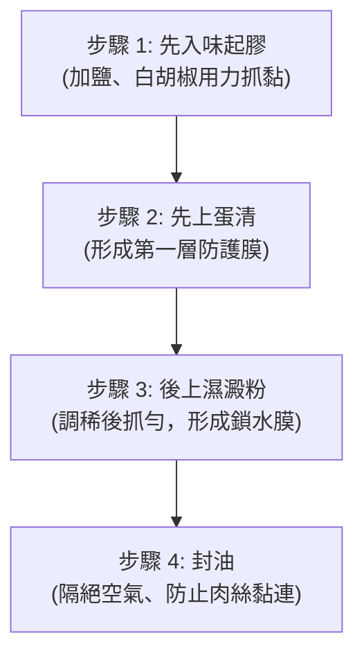

# 大廚級肉絲上漿嫩化法

為什麼大廚炒出來的肉絲（豬肉、雞胸肉、牛肉）總是滑嫩多汁，自己炒的卻又老又柴？關鍵就在於下鍋前的「上漿嫩化」！本技法源自專業廚藝學校的詳細解析，強調上漿的「黃金順序」：**先入味起膠 ➡️ 再上蛋清 ➡️ 後裹濕澱粉 ➡️ 最後封油**。只要掌握這四個核心步驟，即使是極易乾柴的雞胸肉，也能炒出輕輕一拉就斷、口感滑嫩飽滿的極致口感。

## 🥣 準備材料

### 主料
- 待處理的肉類（雞胸肉、豬里肌、牛柳等）：約 300 克（切絲或切片）

### 🧂 上漿調料（依比例微調）
- 鹽巴：少許（入底味與起膠用）
- 白胡椒粉：少許（去腥增香）
- 雞蛋清（蛋白）：適量（約 0.5 顆至 1 顆蛋白即可，不可過多）
- 太白粉（或玉米澱粉）：1 小匙
- 清水：少許（用來調濕澱粉）
- 食用油：少許（封油用）

## 🍳 嫩化上漿步驟（順序絕不能錯！）

1. **第一步：先入味抓至起膠（底味）**
   在切好的肉絲中加入少許鹽巴與白胡椒粉。用手用力抓拌，將水分和鹽分揉入肉的纖維中。**抓至肉絲黏稠、起焦、產生明顯的黏性（起膠）**。
   > [!IMPORTANT]
   > 必須先單獨抓出黏性再進行下一步。若將調味與上漿同時進行，鹽分會被蛋清和澱粉阻隔，導致肉不易入味，且會影響漿的穩定度。
2. **第二步：上蛋清（第一層防護膜）**
   往抓黏的肉絲中加入適量蛋清，用手持續抓拌稍微久一點，使蛋清被肉絲吸收，均勻包裹在肉絲表面，形成第一層柔軟的保護膜。
3. **第三步：上濕澱粉（第二層鎖水膜）**
   在太白粉中加入少許清水，調和成**稀的流體狀（水澱粉/濕澱粉）**。將濕澱粉倒入肉中再次抓勻，讓肉絲表面裹上一層極薄的透明膜。
   > [!CAUTION]
   > 澱粉切記不要直接加乾粉，否則容易結塊且漿會過厚。上漿一定要薄，太厚會影響炒菜的口感與成色。
4. **第四步：表面封油（防變色、防黏連）**
   漿上好後，在肉絲表面淋入少許食用油（約半大匙），輕輕拌勻或平鋪在表面。
   > [!TIP]
   > 封油有兩個關鍵作用：
   > 1. **格局空氣**：防止肉絲在放置過程中氧化變黑、表面變乾。
   > 2. **防黏連**：下鍋泡油或滑炒時，肉絲能迅速散開，不易結成大團。

---

## 💡 科學嫩化原理與小撇步
- **為什麼高溫烹調能鎖水？**
  蛋清和澱粉在高溫下會迅速凝固，在肉絲外圍形成一層保護殼。這層殼能鎖住肉內部的天然水分，使肉在高溫翻炒時不流失肉汁，從而達到「滑嫩不柴」的效果。
- **泡油或滑炒技巧**：
  上好漿的肉絲，建議以「熱鍋冷油」方式滑炒。油溫約 140°C - 150°C 時下鍋，用筷子快速滑散，肉絲一變色（約八分熟）即撈出。待配菜（如青椒、蔥段）炒熟後，再將肉絲倒回鍋中大火快速翻炒幾下起鍋，這能最大化保持肉絲的嫩度。
- **油量擔心？**：
  封油的油在下高溫鍋時會自動釋放進入油鍋，因此在起鍋炒菜時，底油可以酌量減少，把封油的油量計算進去，就不會造成整盤菜過於油膩。
