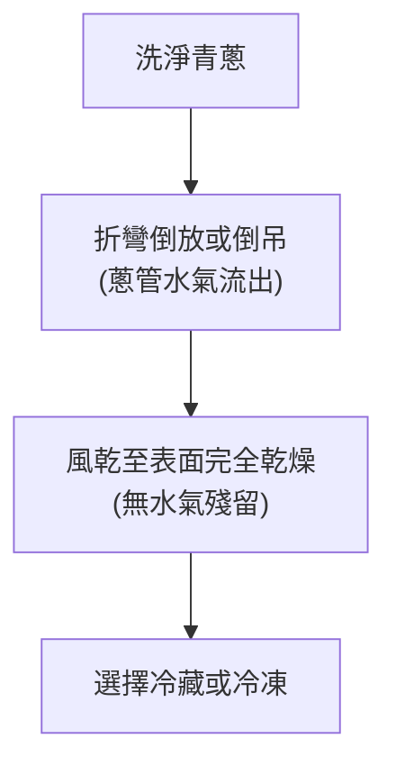

# 阿慶師青蔥完美保存法

每次買一大把青蔥，還沒用完就發黃、腐爛或凍成整塊冰磚？這道指南源自名廚阿慶師的傳授，專門解決青蔥難以保存的痛點。核心原則在於「徹底去除水氣」與「善用倒放原理」。透過這套技法，不僅能延長青蔥在冷藏的保鮮期，更能讓冷凍保存的蔥花粒粒分明，使用時完全不結塊，香氣不減！

---

## 💡 關鍵保存心法：為什麼要「倒放」？

很多主婦/主夫洗蔥後會將蔥管朝上直立晾乾，但這會導致水氣順著蔥葉流進「蔥管」內部，水氣悶在管內無法排出，沒過幾天青蔥就會從內部開始軟爛。

---

## 🛠️ 第一階段：風乾去水氣（倒置晾乾）

1. **清潔蔥管**：
   將買回來的蔥剝除黃葉、洗淨，泥沙多時要特別清洗蔥白分岔處。
2. **折彎倒放**：
   洗淨後的青蔥**不要**正著立放。將整把蔥折彎，使**蔥管口朝下**，倒放在盆器中；或直接用繩子將蔥尾綁起，將蔥**倒掛**於通風陰涼處晾乾。這能讓流進蔥管內的水分順利流出。
3. **風乾避日曬**：
   放在陰涼通風處自然吹乾（可用電風扇微風輔助吹乾），切記**絕不能曬到太陽**，否則蔥葉會脫水發黃並失去香氣。

---

## 📦 第二階段：兩大保存技巧（依使用頻率選擇）

### 🧊 技巧 A：冷藏保存（適合一週內使用）

*   **整把冷藏法**：
    蔥風乾後，用乾淨的**廚房紙巾將整把蔥包裹起來**，放入塑膠袋或保鮮袋中，封口後放入冷藏。紙巾能持續吸附冷藏室產生的冷凝水氣，防止蔥爛掉。
*   **切段層疊法**：
    將風乾的蔥切成蔥段或蔥花。準備一個保鮮盒，**在底部鋪一張廚房紙巾**，放入蔥，上方再蓋上一張廚房紙巾，最後蓋緊盒蓋。同樣利用紙巾上下鎖住水分，能保鮮一週以上。

---

### ❄️ 技巧 B：倒置冷凍法（適合長期存放，防結塊絕招！）

如果想保存一個月以上，且希望使用時**蔥花粒粒分明、不凍成硬冰磚**，請使用這個大廚絕招：

1. **切碎與擦乾**：
   確認風乾的蔥表面已毫無水氣，使用**磨利的刀子**快速切成蔥花（刀子不夠利會壓出蔥汁，導致冷凍易結塊）。
2. **裝盒鋪紙巾**：
   準備一個乾淨乾燥的保鮮盒，在**盒底鋪上一層廚房紙巾**，將切好的蔥花裝入盒中。
3. **「倒置」放入冷凍（核心祕訣）**：
   蓋緊保鮮盒蓋後，**將保鮮盒反過來（上下顛倒，蓋子朝下、底部的紙巾在上方）**放進冷凍庫冷凍。
   > [!IMPORTANT]
   > **倒置防結塊原理**：冷凍過程中，蔥花本身會釋放出微量水氣。水氣遇冷會上升，此時倒置的保鮮盒其紙巾恰好在最上方，能第一時間將上升的水氣完全吸乾。這能防止水氣在盒底結冰而把所有蔥花凍成一塊冰磚。使用時，只需將盒子轉回，蔥花依然粒粒分明，輕輕一倒就散開！
